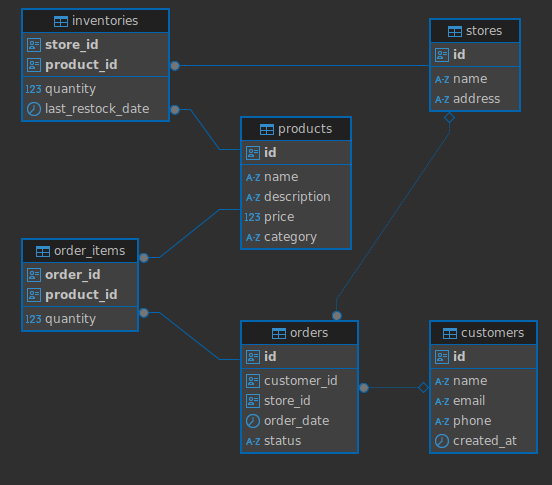

# Предметная область:
Система управления продажами

В рамках выдуманной торговой сети существует сеть магазинов, где клинеты могут делать заказы на продукты. Продукты хранятся на складах этой торговой сети.

У каждого магазина есть свой склад, где хранятся продукты.

Заказ от клиента может содержать несколько видов продуктов

Объекты:
- Клиенты
- Магазины
- Продукты
- Склады
- Заказы

# Схема данных

## Задачи:
1. Необходимо написать функцию для подсчёта итоговой суммы заказа.
2. Необходимо написать процедуру для добавления заказа клиенту. В заказ может входить n-е число продуктов.
3. Необходимо написать процедуру для генерации отчёта о заказах магазина. В отчёте должно быть отражено:
   - Название или ID магазина
   - Общее число заказов
   - Общаа сумма продаж по магазину
   - Самый популярный продукт (самым популярным считается продукт, который чаще всего попадался в заказах. Если таких несколько, то выводить первый)
   - Топ 5 клиентов (топ клиентов, которые потратили больше всего денег в магазине. Топ идёт от большего к меньшему)
4. Необходимо написать функцию для формирования отчёта о заказе. Отчёт должен возвращаться в формате JSON. В отчёт должны входить:
   - id заказа
   - имя клиента, сформировавшего заказ
   - название магазина, куда был оформлен заказ
   - конечная стоимость заказа
   - статус заказа
   - продукты, которые входят в заказ. Это список словарей. Иными словами тоже JSON. В каждую запись должны входить:
     - id продукта
     - название продукта
     - количество заказанного продукта
     - стоимость продукта
     - стоимость всех продуктов данной позиции
